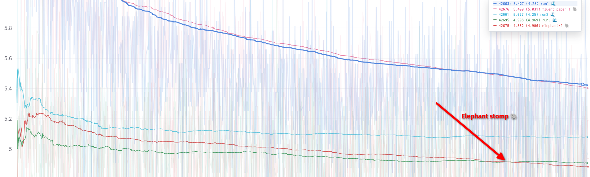

# BakaLLM: Elephant Edition

This is an elephant branch. Mr $$\frac{1}{1+\abs{\frac{x}{a}}^d}$$ as we call him.

## Architecture 

The https://arxiv.org/pdf/2310.01365.pdf was implemented

## Graph on training:

On the first epoch elehant was somewhat better than SWiGLU.
But on the second.. It surpassed three epochs of SwiGLU after two epochs.

(I also not sure why models have seizures in the beginning - I store and reload optimizer state)

Its loss after 3 epochs is 4.5461

Not enough to beat pythia-14m on valid split on ctx=512 with loss of 4.4511, but very close, and most likely possible with more training.

I tried to teach MLP layers only to see a) if such training is faster b) if it will do it, but had to stop in the middle of the training as needed to reboot the machine. It got very close after about half a training(4.4763) but pythia-14m still has edge of lots of seen tokens. 

I didn't finish the training as it was not faster and there is was no reason to beat 14m model anyway. 
BakaLLM is a playground for architectural tweaks, not running over wikitext103 again and again, which I do on workdays, as one run
takes 7 hours - ~1 work day, how convenient!
