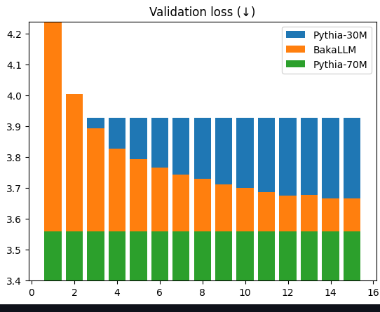

# BakaFanOut: Reach for the stars!

Based on Llama* https://github.com/ggerganov/llama.cpp/discussions/4147

Base idea is to change hidden_size.

Unlike Llama* where output is upcasts at the very end, 
BakaLLM upcasts each component it adds to result: MLP and Attentnio.

Llama* proposes linear projection for upscaling.
BakaLLM upscales residual connection only(as other output are already upscaled)
To upscale residual connection BakaLLM injects zeros in such way that multi-head attention of next layer would receive the same
inputs if MLP and ATTN of current layer were to be zeroed out. In other words, new values are affected only by ATTN, MLP of current layer
and NORM of next layer, residual connection doesn't affect new data directly.

This also allows for simple RMT processing: 
when we need to pass RMT from the last layer to the first one, we split last layer to num_heads and from each head we take as many top values, as much
as they exist in the first layer.

## Validation after 15 epochs 

4.3281, 4.0054, 3.8932,
3.8268, 3.7947, 3.7671,
3.7440, 3.7304, 3.7109,
3.6997, 3.6869, 3.6749,
3.6781, 3.6656, 3.6674,
