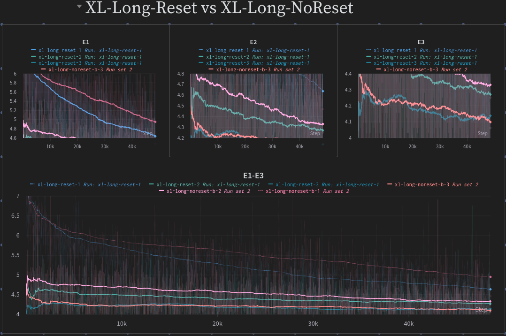

# BakaLLM: XL Repos Edition

To use rotary embedding in XL setting, after bunch of experiments (branches 00x_xl, 00x_xl_repos),
the simple variant is used, similar in Streamling LLM(arxiv.org/abs/2309.17453): Q, K are rerotated each time.
In terms of our context windows (k_past 🐱 k_now) is rotated(offset of whole sequence is 0, offset of k_past is 0, offset of k_now = length of past), q_now is rotated at the same offset as k_now(namely length of the past). 
Epoch 3 loss on valid test: 4.10. 

## Training
It worth noting that at epoch 3 it became somewhat close to XL-Long-NoReset (nothing is rerotated, abosolute position of tokens in sequence is used through out the run). However: valid loss is better(4.10 vs 4.14)

