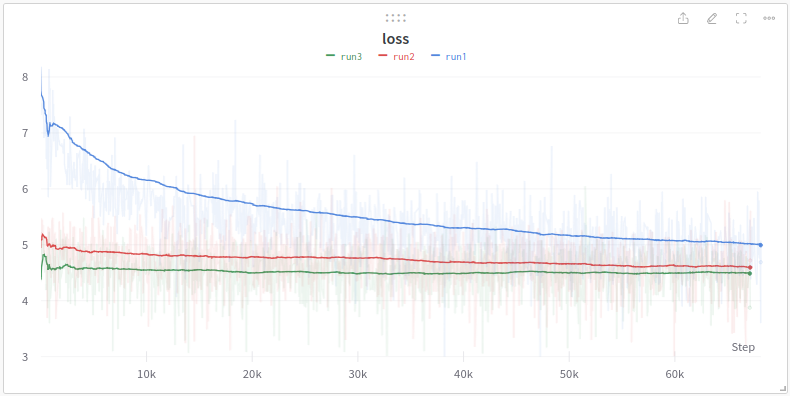

# BakaLLM: Pristine Edition

This is a pristine branch. It contains the most basic implementation of BakaLLM without any fancy stuff,
so possibility of making the grave mistake is small.

## Architecture 

The only fancy thing that was implemented is a sliding window with size 512 (and the same stride). 
It doesn't do anything other than process at most 512 tokens at once.
But the sliding window is one of the core approach in BakaLLM and all further improvements will rely heavily
on eximing history of sliding window.

Pristine follows the parallel residue optionally found in GPT Neo X.

`>>> x = x + attn(ln1(x)) + mlp(ln2(x))`

However just like Stable LM alpha v2, (stabilityai/stablelm-base-alpha-3b-v2) it uses only one prenorm.
i.e. ln2=ln1.

It worth checking later maybe using separate allows them to perform better: 
generally LN is the only point in network where bias is introduced (all nn.Linear use bias=False) 

AVGLOSS: 4.97995, PPL: 145.46682 NANS:0, NCTX: 1048576

That's worse than pythia-14m(4.32544 at ctx_size=2K, 4.45 at 512), which is to be expected at this point.

## Graph on training:

## Benchmark

Benchmark requires `result/resutls.sqlite3` DB to log information. A script to create it is included.

A measurement of other models will be done on later day, I expec them to work in the [ballpark](https://dev.to/maykeye/bakallm-part-3-its-testing-time-its-testing-time-516d) of my cleaned version

Oh, the reason dataset for validation(and training) was switched is because I think it's more reproducible this way:
I don't want to upload wikitext103-cleaned, so I used a version I found.